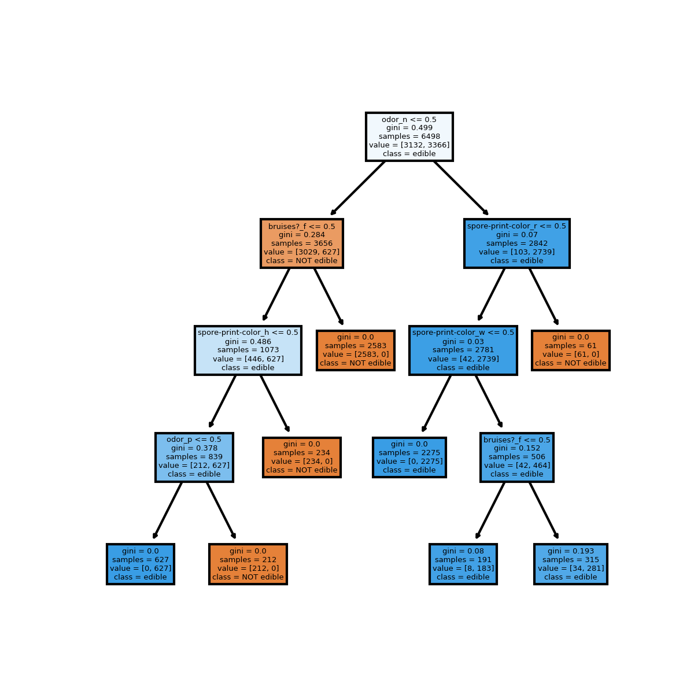

# Mushroom Classification

## Overview and Purpose

This project started as an introductory exploration into Kedro
More bluntly put, it started as a search to better organize machine learning pipelines

## Dataset Context

[Link to Dataset on UCI ML Website](https://archive.ics.uci.edu/ml/datasets/mushroom)
- Mushrooms do not have a simple heuristic for understanding if a species is poisonous
- The machine learning pipelines seek to first create a standard binary classifier for determing if mushrooms are poisonous
- Then, additional functions are used to create a simpler tree-based classifier from the most important features
- The tree-based method is later outputted to an image for future reference 

## How to get started

1. clone repository with:
```
git clone https://github.com/van-william/kedro-classification-mushrooms.git
```
2. Install dependencies with:
```
pip install -r src/requirements.txt
```
3. Run pipelines in command line:
```
kedro run
```
NOTE: the above command runs the default pipeline(s); in this case, it runs data processing then exploratory data analysis then data science. All three pipelines can be run individually with the below commands:
``` 
kedro run --pipeline dp
kedro run --pipeline eda
kedro run --pipeline ds
```

## Notebook Usage
- A Jupyter Notebook was used for initial EDA, scratchwork
- This is provided in the Notebooks directory

## Example Output
See below for an example image output of a simplified heuristic for mushroom poison test (~99% accurate for 23 varieties)

